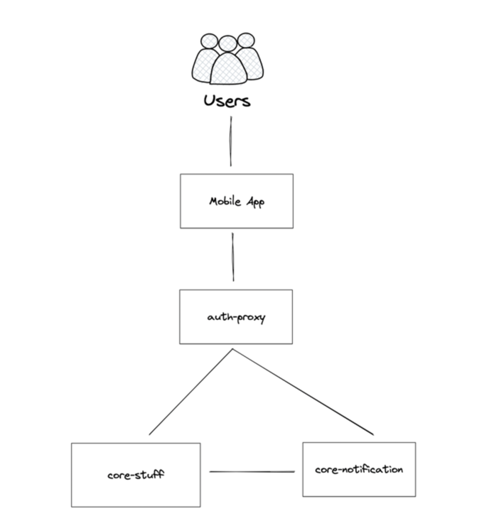

# Разработка мобильных приложений 2023

## Команда

1. Панчук Максим
2. Бордун Анастасия
3. Макаров Ньургун
4. Цыпандин Николай

## Описание продукта

Android приложение – маркетплейс техники: телефоны, наушники, ноутбуки. В данном маркетплейсе поставщики могут
выкладывать свои товары, а покупатели ознакомиться с ассортиментом и связаться с поставщиком

## Роли

### Поставщик

Поставщик техники, который в крупных размерах продаёт некоторое множество разной техники.
Заинтересован в увеличении объёма продаж и в поиске новых клиентов/покупателей

### Покупатель

Покупатель техники, в данной нише это как правило перекупщик, продаёт технику в розницу, под брендом, с гарантией и.т.д.
Заинтересован в закупке технике по более выгодной цене

## Функциональные требования

1. Покупатель может осуществлять поиск модели по ключевым параметрам: Тип техники, объём памяти, цвет и.т.д.
2. Покупатель может подписаться на модель и следить за любым из трех ее изменений:
    * Удаление позиции одним из поставщиков в этой модели
    * Обновление цены позиции одним из поставщиков
    * Добавление новой позиции в эту модель

3. Покупатель может получать уведомления о любом событии в модели
4. Покупатель может отказаться от подписки на модель
5. Покупатель может отправить поставщику уведомление о готовности приобрести несколько товарных позиций определенной
   модели и указать количество

6. Поставщик может загрузить или удалить прайс-лист в систему
7. Поставщик может просмотреть пришедшие ему уведомления
8. Поставщик может ознакомиться с контактной информацией пользователя, отправившего уведомление

## Нефункциональные требования

1. Целевое решение должно быть реализовано на следующих инструментах:
    - Языки программирования:
        - `Kotlin`
        - `Golang`
    - Фреймворки и SDK:
        - `Spring Boot`
        - `Ktor`
        - `Android SDK`
    - Базы Данных
        - `PostgreSQL`
    - Очереди сообщений
        - `Redis pub/sub`
2. TODO

## Схема компонент приложения



Система должна состоять из компонент:

1) `Mobile App` — Android приложение
2) `auth-proxy` – компонент, отвечающий за аутентификацию/авторизацию и routing запросов с клиента
3) `core-stuff` – компонент, отвечающий за товары: хранение, изменение, чтение
4) `core-notification` – компонент, отвечающий за обработку уведомлений

## REST эндпоинты

Для всех эндпоинтов в случае корректного ответа ожидается ответ `HTTP 200 OK`.

### `POST /v1/supplier/stuff` – Выгрузка товаров поставщиком

<b>Заголовки</b>

```text
UserID: ...
```

<b>Тело запроса</b>

```json
{
  "text": "..."
}
```

<b>Ответы</b>

`200 OK`

<b> Описание </b>

Все поставщики сейчас ведут телеграм канал, где они каждый день публикуют новый прайс-лист на свой товар. Например,
можно встретить сообщения вида:

```text
      📱📱 IPhone 📱📱
  
13Pro 1TB Blue       87000🇪🇺
13Pro 1TB Gold       86800🇪🇺
13Pro 1TB Green      87000🇪🇺
13Pro 1TB Gray       87000🇪🇺
13Pro Max 256 Blue  115000🇷🇺
12 64 Blue           38700🇮🇳
12 64 Green          38500🇮🇳
12 64 Gray           39500🇮🇳
12 64 Silver         39500🇮🇳
12 64 Purple         40000🇮🇳
```

Мы пытаемся максимально упростить им использование нашего приложения,
поэтому они просто могут выгрузить вставить привычный им прайс-лист из своего канала в наше приложение.
Система сама распознает из текста товар и добавит в базу данных.

### `GET /v1/supplier/stuff` – Получение товаров поставщиком

<b>Заголовки</b>

```text
UserID: ...
```

<b>Ответы</b>

`200 OK` – Запрос обработан, в ответе содержатся текущий ассортимент товаров поставщика

```json
[
  {
    "stuff_type": "IPHONE",
    "model_id": "IPHONE_14_PRO_MAX/GB_256/SPACE_GRAY",
    "title": "Iphone 14 Pro Max 256 GB Space Gray",
    "property_list": [
      {
        "name": "MEMORY",
        "value": "64 GB"
      },
      {
        "name": "COLOR",
        "value": "Space Gray"
      },
      {
        "name": "COUNTRY",
        "value": "США"
      }
    ],
    "price": {
      "amount": "83999.99",
      "currency": "RUB"
    }
  },
  {
    "...": "..."
  }
]
```

<b> Описание </b>

Благодаря этому эндпоинту поставщик всегда знает, какой у него сейчас прайс-лист

### `POST /v1/stuff/search-by-text` – Текстовый поиск товаров

<b>Тело запроса</b>

```json
{
  "text": "Айфон 14 Pro Max Синий"
}
```

<b>Ответы</b>

`200 OK` – Запрос обработан, в теле ответа содержится список товарных единиц в виде предложений от разных поставщиков,
удовлетворяющих запросу

```json
[
  {
    "stuff_type": "IPHONE",
    "model_id": "IPHONE_14_PRO_MAX/GB_256/BLUE",
    "title": "Iphone 14 Pro Max 256 GB Blue",
    "property_list": [
      {
        "name": "MEMORY",
        "value": "256 GB"
      },
      {
        "name": "COLOR",
        "value": "Blue"
      }
    ],
    "supplier_prices": [
      {
        "supplier_id": 275834,
        "price": {
          "amount": "79999.99",
          "currency": "RUB"
        }
      },
      {
        "supplier_id": 114564,
        "price": {
          "amount": "80099.99",
          "currency": "RUB"
        }
      },
      {
        "supplier_id": 89102,
        "price": {
          "amount": "81099.99",
          "currency": "RUB"
        }
      }
    ]
  }
]
```

<b> Описание </b>

Перекупщики, как правило, в один момент времени ищут конкретную модель по самой дешёвой цене.
Этот поиск предоставляет им именно этот функционал в полной мере.

### `POST /v1/notification/stuff` – Подписка или отписка от нотификации

<b>Заголовки</b>

```text
UserID: ...
```

<b>Тело запроса</b>

Подписаться на уведомления модели

```json
{
  "action_type": "SUBSCRIBE",
  "model_id": "IPHONE_14_PRO_MAX/GB_256/SPACE_GRAY"
}
```

Отписаться от уведомлений модели

```json
{
  "action_type": "UNSUBSCRIBE",
  "model_id": "IPHONE_12/GB_128/WHITE"
}
```

<b>Ответы</b>

`200 OK` – Запрос успешно обработан

<b> Описание </b>

Пользователь может подписаться на изменения по конкретной модели.
Например если изменятся цену или товар раскупят, нотификация будет получена

### `GET /v1/notification/list` – Получение нотификаций

<b>Заголовки</b>

```text
UserID: ...
```

<b>Ответы</b>

`200 OK` – Запрос успешно обработан, тело содержит список уведомлений

```json
[
  {
    "status": "NEW",
    "text": "Теперь Iphone 14 Pro Max 256 GB Space Black можно купить всего за 49999!"
  },
  {
    "status": "READ",
    "text": "AirPods Pro были полностью раскуплены!"
  }
]
```

<b> Описание </b>

Ручка нужна для просмотра уведомлений.
Все уведомления помечаются как прочитанные или новые.

## Нотификации

### Обработка

Так как обработка нотификаций всех подписчиков
в ответ на событие об изменении товара большой процесс,
необходимо обрабатывать нотификации в event-driven подходе.

Каждое изменение единицы техники влечёт за собой событие,
которое отправляется в конкретный топик брокера сообщений.

Сервис `core-notification` должен читать этот топик
и реагировать на сообщения обработкой и сохранением готовых к отправке нотификаций.

Сообщения должны иметь следующий формат JSON:

```json
TODO
```

### Получение

Получение нотификаций должно быть реализовано на клиенте,
посредством Long Polling раз в единицу времени.


## Авторизация

Использутеся JWT и два токена: access_token, refresh_token.

access_token находится в заголовке X-Access-Token любого запроса, Auth proxy получает запрос, 
проверяет не истекло ли время жизни токена и валидна ли подпись:

В случае успеха: Насыщает Request идентификатором пользователя и передает запрос на бэк

В случа провала: Возваращает статус 401, который говорит, что необходимо прислать Refresh_token

Когда auth proxy получает refresh_token - он сверяет его с базой данных, и если токены не 
совпадают, значит он был скомпрометирован и редиректит пользователя на login page

Если токены совпали - генерирует новую пару, насыщает response парой ключей, request 
насыщает идентифиактором пользователя и передает запрос на бэк.

Время жизни access_token : 15 minutes
Время жизни refresh_token : 60 hours


## `POST /v1/login` - Логин

<b>Тело запроса</b>

```json
{
   "username": "...", 
   "password": "..."
}
```

## `POST /v1/register` - Регистрация

<b>Тело запроса</b>

```json
{
   "username": "...", 
   "password": "...",
   "role": "..."
}
```

